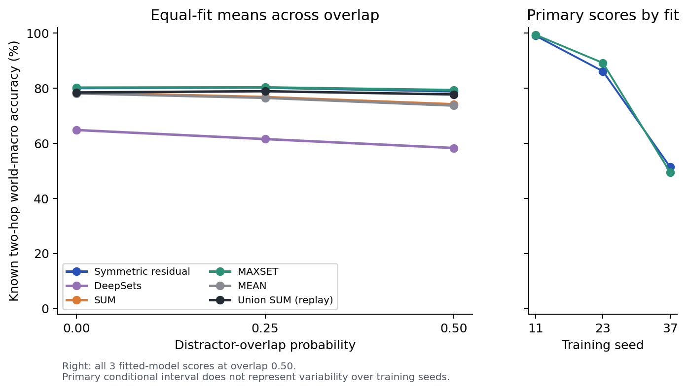
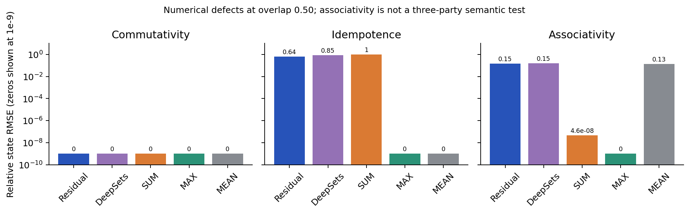
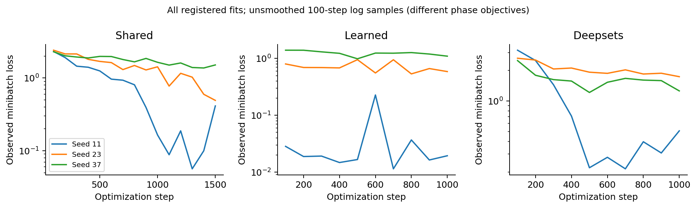

# Locked pilot results / 冻结试验结果

**H1 unsupported in this synthetic pilot:** residual − MAXSET = **-0.47 percentage points**, paired world-bootstrap conditional 95% interval **[-1.23, +0.32]**.

该区间以这三份已训练模型为条件，不覆盖任意训练随机种子的总体不确定性。主终点保持冻结定义，没有以其他基线或分层替换。

最强简单基线为 **MAXSET**；五种有效合并方法中最高均值为 **MAXSET**。与 MAXSET 的主比较不能解释成战胜所有方法。

执行范围：3 个训练种子 × 3 个条件 × 1,000 世界 × 4 查询；11 方法，共 **396,000** 行预测。实际运行 **137.7 秒**，不作为端到端性能基准。

运行前冻结 UTC：`2026-10-08T16:32:32.407124+00:00`。客户日期 `2026-10-09`（Asia/Shanghai）。本地 SHA 冻结，不是外部注册。

## Primary outcomes by fit

| Seed | Eligible worlds | Eligible queries | Residual (%) | MAXSET (%) | Difference (pp) |
|---|---:|---:|---:|---:|---:|
| 11 | 898 | 1475 | 99.05 | 99.39 | -0.33 |
| 23 | 881 | 1443 | 86.15 | 89.16 | -3.01 |
| 37 | 885 | 1458 | 51.36 | 49.44 | +1.92 |

## All methods at overlap 0.50

All entries equally average the three fits. These are descriptive means, not additional confirmatory tests. ECE uses 10 fixed-width bins.

| Method | Known 2-hop world macro (%) | All queries (%) | Known (%) | One-hop (%) | Two-hop incl unknown (%) | Unknown recall (%) | ECE |
|---|---:|---:|---:|---:|---:|---:|---:|
| Symmetric residual | 78.85 | 78.10 | 84.12 | 82.02 | 74.18 | 60.33 | 0.0285 |
| DeepSets | 58.31 | 64.53 | 68.14 | 71.50 | 57.55 | 53.72 | 0.0520 |
| SUM | 74.18 | 76.20 | 81.33 | 81.30 | 71.10 | 61.04 | 0.0268 |
| MAXSET | 79.33 | 78.64 | 85.00 | 82.58 | 74.70 | 59.87 | 0.0311 |
| MEAN | 73.69 | 76.24 | 81.04 | 81.40 | 71.08 | 62.06 | 0.0278 |
| A only | 5.85 | 44.42 | 34.58 | 62.92 | 25.92 | 74.16 | 0.3618 |
| B only | 5.77 | 45.43 | 35.71 | 64.48 | 26.38 | 74.82 | 0.3549 |
| Zero | 0.00 | 25.03 | 0.00 | 23.00 | 27.07 | 100.00 | 0.7036 |
| Swapped B | 16.15 | 30.93 | 31.59 | 41.17 | 20.70 | 29.20 | 0.4115 |
| Union SUM (replay) | 77.74 | 78.26 | 83.85 | 82.50 | 74.02 | 61.73 | 0.0259 |
| Union MAX (replay) | 79.33 | 78.64 | 85.00 | 82.58 | 74.70 | 59.87 | 0.0311 |

Union references reread deduplicated raw facts; they are privileged references, not guaranteed accuracy upper bounds. Swapped B is a destructive evidence-matching control. Single-party and zero states are controls, not alternative joint-memory models.

## Overlap sweep

| Method | 0.00 (%) | 0.25 (%) | 0.50 (%) |
|---|---:|---:|---:|
| Symmetric residual | 80.06 | 80.23 | 78.85 |
| DeepSets | 64.83 | 61.55 | 58.31 |
| SUM | 78.45 | 76.79 | 74.18 |
| MAXSET | 80.21 | 80.30 | 79.33 |
| MEAN | 78.10 | 76.50 | 73.69 |
| A only | 4.89 | 5.16 | 5.85 |
| B only | 4.79 | 5.84 | 5.77 |
| Zero | 0.00 | 0.00 | 0.00 |
| Swapped B | 12.79 | 14.96 | 16.15 |
| Union SUM (replay) | 78.45 | 78.91 | 77.74 |
| Union MAX (replay) | 80.21 | 80.30 | 79.33 |

## Realized labels

Only one method is counted, because the methods share labels. Deletion opportunities were 0.20 per path; the actual unknown class fraction differs.

| Seed | Condition | Worlds | Queries | Known | Unknown | Unknown fraction (%) | Known two-hop queries |
|---|---|---:|---:|---:|---:|---:|---:|
| 11 | overlap_0.0 | 1000 | 4000 | 3002 | 998 | 24.95 | 1458 |
| 11 | overlap_0.25 | 1000 | 4000 | 3032 | 968 | 24.20 | 1456 |
| 11 | overlap_0.5 | 1000 | 4000 | 3025 | 975 | 24.38 | 1475 |
| 23 | overlap_0.0 | 1000 | 4000 | 2980 | 1020 | 25.50 | 1461 |
| 23 | overlap_0.25 | 1000 | 4000 | 3031 | 969 | 24.22 | 1472 |
| 23 | overlap_0.5 | 1000 | 4000 | 2991 | 1009 | 25.22 | 1443 |
| 37 | overlap_0.0 | 1000 | 4000 | 3005 | 995 | 24.88 | 1474 |
| 37 | overlap_0.25 | 1000 | 4000 | 3071 | 929 | 23.23 | 1506 |
| 37 | overlap_0.5 | 1000 | 4000 | 2980 | 1020 | 25.50 | 1458 |

## State algebra diagnostics

Relative state RMSE, mean across fits. This is numerical state behavior; it is not semantic convergence. The frozen associativity probe rolls one query row, so 75% of the third states coincide with A. No same-world three-party answer experiment was run.

| Method | Commutativity | Idempotence | Associativity (weak numeric probe) |
|---|---:|---:|---:|
| Symmetric residual | 0 | 0.636036 | 0.148559 |
| DeepSets | 0 | 0.853216 | 0.154783 |
| SUM | 0 | 1 | 4.62716e-08 |
| MAXSET | 0 | 0 | 0 |
| MEAN | 0 | 0 | 0.133754 |

## Resources and provenance

| Seed | Shared parameters | Residual parameters | DeepSets parameters | Retained floats | Retained bytes | Checkpoint bytes |
|---|---:|---:|---:|---:|---:|---:|
| 11 | 25623 | 6232 | 6320 | 288 | 1152 | 168469 |
| 23 | 25623 | 6232 | 6320 | 288 | 1152 | 168469 |
| 37 | 25623 | 6232 | 6320 | 288 | 1152 | 168469 |

The two input states occupy 2,304 payload bytes; the retained output occupies 1,152 bytes. Peak allocations, model weights and training cost are separate. CPU, one thread, final scheduled checkpoints only. The neural state is larger than a direct table for this tiny world, so this is not strong compression evidence.

## Interpretation and limits

- No pretrained LLM or natural-language data was used. The reader receives six-entity/two-relation IDs and two explicit read passes.
- The main merger has extra supervision and optimization relative to arithmetic baselines. DeepSets has a matched additional training budget, but different inductive bias.
- Overlap concerns identical distractor event tuples, not paraphrases, source trust or semantic deduplication.
- Updates, deletions, conflicts, incompatible encoders, within-party duplication and semantic three-party tests remain unperformed.
- High accuracy on this small known-form task can be saturation. It cannot establish a new general memory paradigm.

Generator rejection-attempt counts were not retained. The audit recomputes saved-prediction statistics and checks recorded private-ambiguity counts; raw facts and per-world states were not archived for independent row-level regeneration. These evidence limitations are detailed in `DEVIATIONS.md` and `results/audit.json`.

See `CLAIMS.md`, `DEVIATIONS.md`, and `docs/NEXT_STAGE.md` for the scientific decision. Machine-readable evidence: `results/pilot/metrics.json`, `predictions.csv.gz`, checkpoints, `artifact_hashes.json`; independent reconstruction: `results/audit.json`.
